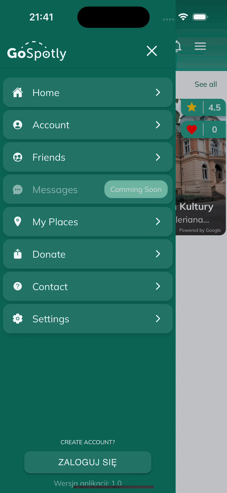
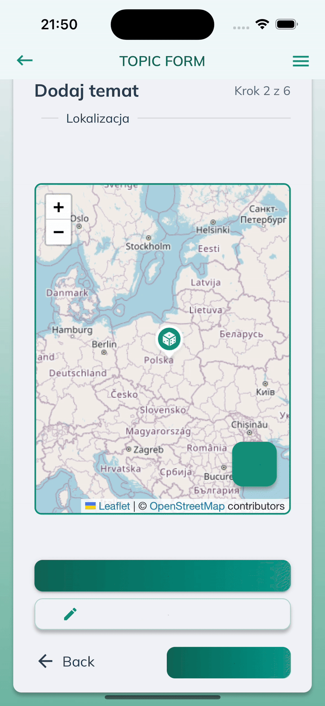
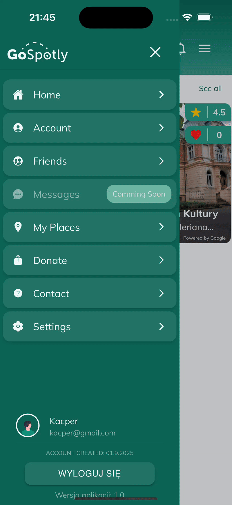
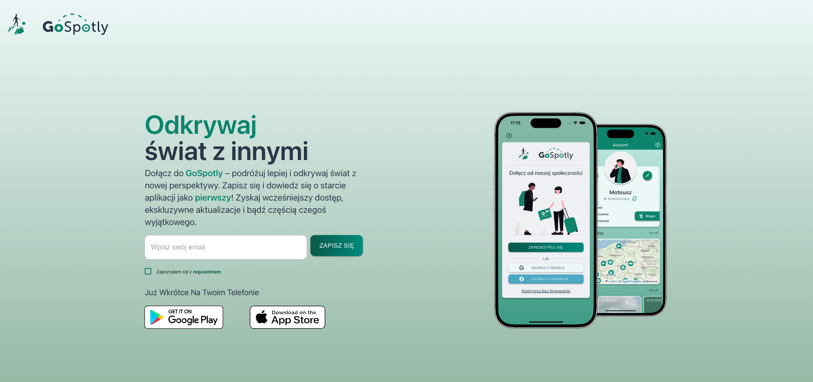
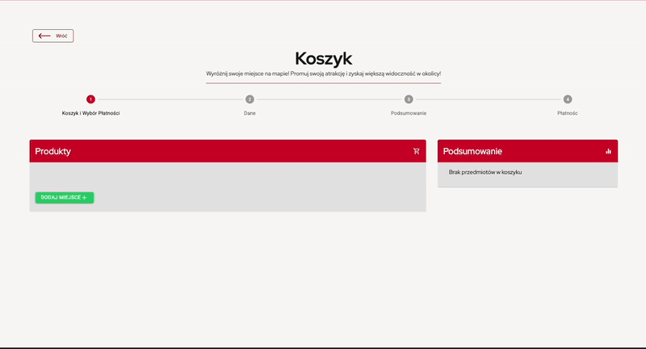

  

 
# My Projects

  
  <h3 align="center">Preview of the App</h3>

<h3>Project Stats:</h3>

📦 **2** Repositories &nbsp;&nbsp; | &nbsp;&nbsp; 📝 **20,000+** Lines of Code &nbsp;&nbsp; | &nbsp;&nbsp; ⏳ **2** Years of Development &nbsp;&nbsp; | &nbsp;&nbsp; 🔨 **900+** Commits &nbsp;&nbsp; | &nbsp;&nbsp; 👤 1 Developer

## About The Project

GoSpotly is a mobile app designed to give users the ability to discover less crowded places in their area, report and document them, create events, and explore spots together with others. The goal is to provide a space where a large community can share and enjoy places for themselves.

> ⚠️ **Warning:**  
> The presented recordings are only for demonstration purposes to showcase the app's functionality and are subject to change before the official release.

<table>
  <tr>
    <td align="center" width="200">
      <h4>🗝️ Login & Registration</h4>
       
    </td>
    <td align="center" width="200">
      <h4>⚙️ App Settings</h4>
       
    </td>
  </tr>
  <tr>
    <td align="center" width="200">
      <h4>📝 Advanced Forms</h4>
       
    </td>
    <td align="center" width="200">
      <h4>📍 Places & Reactions</h4>
       
    </td>
  </tr>
  <tr>
    <td align="center" width="200">
      <h4>👥 Friends</h4>
       
    </td>
  </tr>
</table>

 <a href="https://gospotly.com/">
  
  ## Join Newsletter 📝
  </a>

 <a href="https://gospotly.com/">
 
  </a>
 

  <h3>🛒 Shop & 🛠️ Admin Panel Preview</h3>
 

## About This Preview

This preview highlights the shop and admin panel of GoSpotly, showcasing features like the shopping cart, payment processing, place promotion, and administrative tools. The full app includes additional functionalities such as discovering places, reporting spots, creating events, and community interactions, which are not covered here.

> ⚠️ **Warning:**  
> The presented recordings are only for demonstration purposes to showcase the app's functionality and are subject to change before the official release.

    
    

### Built With

- ⚛️ 
- ⬛ 
- 🔥 
- 🌊 
- 🔌 
- 🟢 
- 💙 
- ☁️ 
- 💳 

